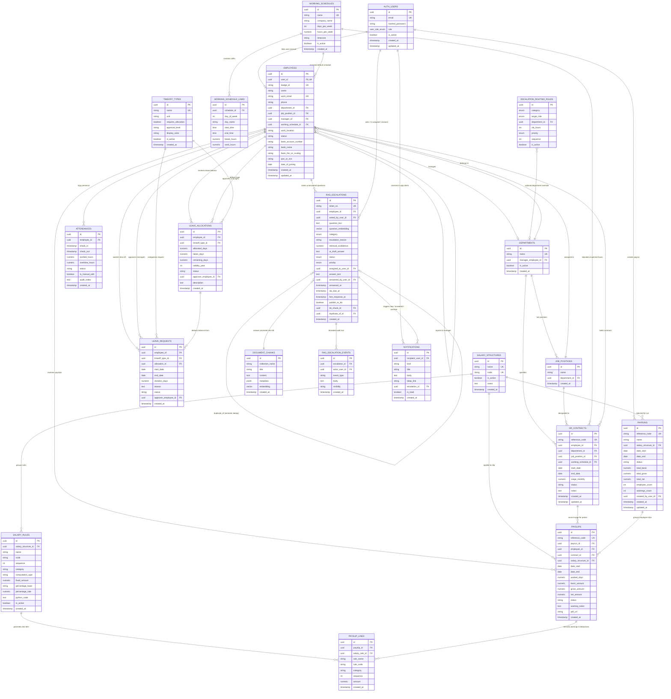

# 🗄️ PeoplePay360: Complete Production Entity-Relationship (ER) Schema
> **Standard**: Odoo 18-Grade Enterprise Relational Architecture  
> **Database Engine**: PostgreSQL 18 + `pgvector` 0.8+  
> **Integrity Level**: Strict Foreign Key Cascades, Exclusion Constraints, Generated Columns, Audit Tracking, and Vector Dimensions.

---

## 📐 1. Full Visual Entity-Relationship (Mermaid Diagram)

---

## 📊 2. Detailed Data Dictionary & Field Specifications

### 1. `auth_users` (System Accounts & Security)
| Field Name | Data Type | Nullable | Default | Constraints & Relationships | Purpose |
| :--- | :--- | :--- | :--- | :--- | :--- |
| `id` | `UUID` | No | `gen_random_uuid()` | **PRIMARY KEY** | Unique user account ID |
| `email` | `VARCHAR(255)` | No | - | **UNIQUE**, lowercase indexed | Login identifier |
| `hashed_password` | `VARCHAR(255)` | No | - | Bcrypt hash format | Secure credential storage |
| `role` | `user_role_enum` | No | `'EMPLOYEE'` | `ADMIN`, `HR_PAYROLL_MANAGER`, `HR_PAYROLL_USER`, `HR_MANAGER`, `EMPLOYEE` | RBAC access gating |
| `is_active` | `BOOLEAN` | No | `TRUE` | - | Account lockout switch |
| `created_at` | `TIMESTAMPTZ` | No | `NOW()` | - | Audit trail |
| `updated_at` | `TIMESTAMPTZ` | No | `NOW()` | - | Audit trail |

---

### 2. `departments` & `job_positions` (Organizational Hierarchy)
#### `departments`
| Field Name | Data Type | Nullable | Constraints & Relationships | Purpose |
| :--- | :--- | :--- | :--- | :--- |
| `id` | `UUID` | No | **PRIMARY KEY** | Unique Department ID |
| `name` | `VARCHAR(100)` | No | **UNIQUE** (e.g. `Finance`, `Engineering`) | Department label |
| `manager_employee_id` | `UUID` | Yes | **FOREIGN KEY** $\to$ `employees(id)` | Head of Department |
| `is_active` | `BOOLEAN` | No | Default `TRUE` | Department active status |
| `created_at` | `TIMESTAMPTZ` | No | Default `NOW()` | Audit record |

#### `job_positions`
| Field Name | Data Type | Nullable | Constraints & Relationships | Purpose |
| :--- | :--- | :--- | :--- | :--- |
| `id` | `UUID` | No | **PRIMARY KEY** | Unique Job Position ID |
| `name` | `VARCHAR(100)` | No | e.g. `Payroll Specialist`, `Developer` | Designation label |
| `department_id` | `UUID` | No | **FOREIGN KEY** $\to$ `departments(id)` ON DELETE RESTRICT | Department grouping |

---

### 3. `working_schedules` & `working_schedule_lines` (Operational Shift Engine)
#### `working_schedules`
| Field Name | Data Type | Nullable | Constraints & Relationships | Purpose |
| :--- | :--- | :--- | :--- | :--- |
| `id` | `UUID` | No | **PRIMARY KEY** | Unique Schedule ID |
| `name` | `VARCHAR(100)` | No | **UNIQUE** (`40 Hours / Week`) | Name of standard shift |
| `company_name` | `VARCHAR(100)` | No | Default `'OXP Pvt Ltd'` | Multi-company segregation |
| `days_per_week` | `INT` | No | Default `5`, Range 1–7 | Working days in cycle |
| `hours_per_week` | `NUMERIC(5,2)` | No | Default `40.00` | Target total working hours |
| `timezone` | `VARCHAR(50)` | No | Default `'Asia/Kolkata'` | Shift timezone context |

#### `working_schedule_lines`
| Field Name | Data Type | Nullable | Constraints & Relationships | Purpose |
| :--- | :--- | :--- | :--- | :--- |
| `id` | `UUID` | No | **PRIMARY KEY** | Unique Line ID |
| `schedule_id` | `UUID` | No | **FOREIGN KEY** $\to$ `working_schedules(id)` ON DELETE CASCADE | Parent schedule |
| `day_of_week` | `INT` | No | `0` (Mon) to `6` (Sun) | Day index |
| `day_name` | `VARCHAR(15)` | No | `Monday`, `Tuesday`, etc. | Display label |
| `start_time` | `TIME` | No | e.g. `09:00:00` | Shift check-in expectation |
| `end_time` | `TIME` | No | e.g. `18:00:00`, `end_time > start_time` | Shift check-out expectation |
| `break_hours` | `NUMERIC(4,2)` | No | Default `1.00` (1 hour lunch) | Unpaid break duration |
| `work_hours` | `NUMERIC(4,2)` | No | **GENERATED ALWAYS AS** `(end - start) - break` | Calculated daily hours |

---

### 4. `employees` (Central Master Hub)
| Field Name | Data Type | Nullable | Constraints & Relationships | Purpose |
| :--- | :--- | :--- | :--- | :--- |
| `id` | `UUID` | No | **PRIMARY KEY** | Central Employee UUID |
| `user_id` | `UUID` | Yes | **UNIQUE, FOREIGN KEY** $\to$ `auth_users(id)` | Linked login account |
| `badge_id` | `VARCHAR(20)` | No | **UNIQUE** (e.g. `EMP-001`) | Company badge code |
| `name` | `VARCHAR(150)` | No | Indexed | Full employee name |
| `work_email` | `VARCHAR(255)` | No | **UNIQUE**, Indexed | Professional email |
| `phone` | `VARCHAR(25)` | Yes | - | Mobile contact number |
| `department_id` | `UUID` | Yes | **FOREIGN KEY** $\to$ `departments(id)` | Department assignment |
| `job_position_id` | `UUID` | Yes | **FOREIGN KEY** $\to$ `job_positions(id)` | Position designation |
| `manager_id` | `UUID` | Yes | **FOREIGN KEY** $\to$ `employees(id)` (Self Reference) | Direct Reporting Manager |
| `working_schedule_id`| `UUID` | Yes | **FOREIGN KEY** $\to$ `working_schedules(id)` | Default work shift |
| `work_location` | `VARCHAR(100)` | Yes | Default `'Mumbai'` | Office location |
| `status` | `VARCHAR(20)` | No | Default `'ACTIVE'` (`ACTIVE`, `INACTIVE`) | Employment status |
| `bank_account_number`| `VARCHAR(50)` | Yes | Sensitive private info | Direct deposit disbursement |
| `bank_name` | `VARCHAR(100)` | Yes | Sensitive private info | Bank institution name |
| `bank_ifsc_or_routing`|`VARCHAR(30)` | Yes | Sensitive private info | Bank routing code |
| `pan_or_ssn` | `VARCHAR(30)` | Yes | Sensitive private info | Tax identification number |
| `date_of_joining` | `DATE` | No | Default `CURRENT_DATE` | Career tenure start |

---

### 5. `hr_contracts` (Historical Wage & Period Agreements)
| Field Name | Data Type | Nullable | Constraints & Relationships | Purpose |
| :--- | :--- | :--- | :--- | :--- |
| `id` | `UUID` | No | **PRIMARY KEY** | Unique Contract ID |
| `reference_code` | `VARCHAR(30)` | No | **UNIQUE** (e.g. `CON/2026/0042`) | Official reference code |
| `employee_id` | `UUID` | No | **FOREIGN KEY** $\to$ `employees(id)` ON DELETE CASCADE | Employee holder |
| `department_id` | `UUID` | Yes | **FOREIGN KEY** $\to$ `departments(id)` | Contractual department |
| `job_position_id`| `UUID` | Yes | **FOREIGN KEY** $\to$ `job_positions(id)` | Contractual job title |
| `working_schedule_id`| `UUID` | Yes | **FOREIGN KEY** $\to$ `working_schedules(id)` | Contract working hours |
| `start_date` | `DATE` | No | - | Contract valid from |
| `end_date` | `DATE` | Yes | `end_date IS NULL OR end_date >= start_date` | Contract valid until (NULL=ongoing) |
| `wage_monthly` | `NUMERIC(12,2)`| No | `CHECK (wage_monthly >= 0)` | Monthly base compensation |
| `status` | `VARCHAR(20)` | No | `'DRAFT'`, `'RUNNING'`, `'EXPIRED'`, `'CANCELLED'`| Contract lifecycle state |
| `notes` | `TEXT` | Yes | - | Salary notes / terms |

> 🛡️ **Zero-Loophole Database Guard**:  
> A PostgreSQL exclusion trigger prevents inserting or updating any contract to `RUNNING` status if another `RUNNING` contract exists for the same employee within an overlapping date range.

---

### 6. `attendances` (Real-Time Presence Logs)
| Field Name | Data Type | Nullable | Constraints & Relationships | Purpose |
| :--- | :--- | :--- | :--- | :--- |
| `id` | `UUID` | No | **PRIMARY KEY** | Unique Attendance Record ID |
| `employee_id` | `UUID` | No | **FOREIGN KEY** $\to$ `employees(id)` ON DELETE CASCADE | Logged employee |
| `check_in` | `TIMESTAMPTZ` | No | Indexed | Time of shift entry |
| `check_out` | `TIMESTAMPTZ` | Yes | `check_out IS NULL OR check_out >= check_in` | Time of shift departure |
| `worked_hours` | `NUMERIC(5,2)` | Yes | Default `0.00` | Net calculated hours worked |
| `overtime_hours`| `NUMERIC(5,2)` | Yes | Default `0.00` | Hours exceeding schedule target |
| `status` | `VARCHAR(20)` | No | `'PRESENT'`, `'LATE'`, `'ABSENT'`, `'HALF_DAY'` | Attendance evaluation |
| `is_manual_edit`| `BOOLEAN` | No | Default `FALSE` | Audit flag for HR overrides |
| `audit_notes` | `TEXT` | Yes | - | Reason for manual correction |

---

### 7. `timeoff_types`, `leave_allocations` & `leave_requests` (Leave Management)
#### `timeoff_types`
| Field Name | Data Type | Nullable | Constraints & Relationships | Purpose |
| :--- | :--- | :--- | :--- | :--- |
| `id` | `UUID` | No | **PRIMARY KEY** | Unique Type ID |
| `name` | `VARCHAR(50)` | No | **UNIQUE** (`Paid Time Off`, `Sick Leave`, `Comp Off`) | Policy title |
| `unit` | `VARCHAR(10)` | No | `'DAYS'` or `'HOURS'` | Accounting unit |
| `requires_allocation`|`BOOLEAN` | No | Default `TRUE` | Whether prior balance is required |
| `approval_level`| `VARCHAR(20)` | No | `'MANAGER'`, `'HR_OFFICER'`, `'NONE'` | Workflow authority required |
| `display_color`| `VARCHAR(20)` | No | Default `'#017E84'` | UI calendar/tag color |

#### `leave_allocations`
| Field Name | Data Type | Nullable | Constraints & Relationships | Purpose |
| :--- | :--- | :--- | :--- | :--- |
| `id` | `UUID` | No | **PRIMARY KEY** | Unique Allocation ID |
| `employee_id` | `UUID` | No | **FOREIGN KEY** $\to$ `employees(id)` ON DELETE CASCADE | Credited employee |
| `timeoff_type_id`|`UUID` | No | **FOREIGN KEY** $\to$ `timeoff_types(id)` | Leave category credited |
| `allocated_days`| `NUMERIC(5,2)` | No | `CHECK (allocated_days >= 0)` | Total granted days |
| `taken_days` | `NUMERIC(5,2)` | No | Default `0.00`, `taken_days <= allocated_days` | Consumed days |
| `remaining_days`|`NUMERIC(5,2)` | No | **GENERATED ALWAYS AS** `allocated - taken` | Live available balance |
| `validity_year`| `INT` | No | e.g. `2026` | Annual balance year |
| `status` | `VARCHAR(20)` | No | `'TO_APPROVE'`, `'APPROVED'`, `'REFUSED'` | Balance approval state |
| `approver_employee_id`|`UUID` | Yes | **FOREIGN KEY** $\to$ `employees(id)` | Authorizing manager |

#### `leave_requests`
| Field Name | Data Type | Nullable | Constraints & Relationships | Purpose |
| :--- | :--- | :--- | :--- | :--- |
| `id` | `UUID` | No | **PRIMARY KEY** | Unique Request ID |
| `employee_id` | `UUID` | No | **FOREIGN KEY** $\to$ `employees(id)` ON DELETE CASCADE | Requesting employee |
| `timeoff_type_id`|`UUID` | No | **FOREIGN KEY** $\to$ `timeoff_types(id)` | Category of absence |
| `allocation_id`| `UUID` | Yes | **FOREIGN KEY** $\to$ `leave_allocations(id)` | Linked bucket deducted from |
| `start_date` | `DATE` | No | - | Leave start date |
| `end_date` | `DATE` | No | `end_date >= start_date` | Leave end date |
| `duration_days`| `NUMERIC(4,2)` | No | `CHECK (duration_days > 0)` | Net business days off |
| `reason` | `TEXT` | Yes | - | Employee statement |
| `status` | `VARCHAR(20)` | No | `'TO_APPROVE'`, `'APPROVED'`, `'REFUSED'` | Request workflow state |
| `approver_employee_id`|`UUID` | Yes | **FOREIGN KEY** $\to$ `employees(id)` | Deciding manager |

---

### 8. `salary_structures` & `salary_rules` (Salary Calculation Engine)
#### `salary_structures`
| Field Name | Data Type | Nullable | Constraints & Relationships | Purpose |
| :--- | :--- | :--- | :--- | :--- |
| `id` | `UUID` | No | **PRIMARY KEY** | Unique Structure ID |
| `name` | `VARCHAR(100)` | No | **UNIQUE** (`Regular Salary`, `Intern Salary`) | Structure title |
| `code` | `VARCHAR(50)` | No | **UNIQUE** (`REG_SALARY`) | System identifier |
| `is_active` | `BOOLEAN` | No | Default `TRUE` | Enable/disable structure |

#### `salary_rules`
| Field Name | Data Type | Nullable | Constraints & Relationships | Purpose |
| :--- | :--- | :--- | :--- | :--- |
| `id` | `UUID` | No | **PRIMARY KEY** | Unique Rule ID |
| `salary_structure_id`|`UUID`| No | **FOREIGN KEY** $\to$ `salary_structures(id)` ON DELETE CASCADE | Parent structure |
| `name` | `VARCHAR(100)` | No | e.g. `Basic Salary`, `Provident Fund` | Line item title |
| `code` | `VARCHAR(30)` | No | e.g. `BASIC`, `HRA`, `GROSS`, `PF`, `NET` | Formula code variable |
| `sequence` | `INT` | No | Default `10`, Ordered computation sequence | Evaluation order |
| `category` | `VARCHAR(30)` | No | `'BASIC'`, `'ALLOWANCE'`, `'GROSS'`, `'DEDUCTION'`, `'NET'`| Payroll classification |
| `computation_type`|`VARCHAR(20)`| No | `'FIXED'`, `'PERCENTAGE'`, `'PYTHON_CODE'` | Mathematical method |
| `fixed_amount` | `NUMERIC(12,2)`| Yes| Used when type is `'FIXED'` | Constant currency value |
| `percentage_base`|`VARCHAR(30)` | Yes| `'WAGE'`, `'BASIC'`, `'GROSS'` | Denominator for percentage |
| `percentage_rate`|`NUMERIC(5,2)` | Yes| e.g. `50.00` for 50% | Multiplier percentage |
| `python_code` | `TEXT` | Yes| e.g. `result = categories['BASIC'] * 0.20` | Dynamic AST-safe expression |

---

### 9. `payruns`, `payslips` & `payslip_lines` (Payroll Execution & Payouts)
#### `payruns`
| Field Name | Data Type | Nullable | Constraints & Relationships | Purpose |
| :--- | :--- | :--- | :--- | :--- |
| `id` | `UUID` | No | **PRIMARY KEY** | Unique Payrun Batch ID |
| `reference_code` | `VARCHAR(30)` | No | **UNIQUE** (e.g. `PAY/2026/0001`) | Official sequence code |
| `name` | `VARCHAR(100)` | No | e.g. `February 2026` | Period label |
| `salary_structure_id`|`UUID` | No | **FOREIGN KEY** $\to$ `salary_structures(id)` | Structure applied to batch |
| `date_start` | `DATE` | No | - | Payroll cycle start |
| `date_end` | `DATE` | No | `date_end >= date_start` | Payroll cycle end |
| `status` | `VARCHAR(20)` | No | `'DRAFT'`, `'COMPUTED'`, `'VALIDATED'`, `'PAID'` | Batch state machine |
| `total_basic` | `NUMERIC(14,2)`| Yes| Sum of all payslip basic amounts | Aggregate ledger |
| `total_gross` | `NUMERIC(14,2)`| Yes| Sum of all payslip gross amounts | Aggregate ledger |
| `total_net` | `NUMERIC(14,2)`| Yes| Sum of all payslip net payouts | Aggregate ledger |
| `employee_count` | `INT` | Yes| Default `0` | Total employees processed |
| `warnings_count` | `INT` | Yes| Default `0` | Count of detected anomalies |
| `created_by_user_id`|`UUID` | Yes| **FOREIGN KEY** $\to$ `auth_users(id)` | Authorizing payroll officer |

#### `payslips`
| Field Name | Data Type | Nullable | Constraints & Relationships | Purpose |
| :--- | :--- | :--- | :--- | :--- |
| `id` | `UUID` | No | **PRIMARY KEY** | Unique Individual Payslip ID |
| `reference_code` | `VARCHAR(30)` | No | **UNIQUE** (e.g. `SLIP/2026/0001`) | Official slip sequence code |
| `payrun_id` | `UUID` | No | **FOREIGN KEY** $\to$ `payruns(id)` ON DELETE CASCADE | Parent Payrun batch |
| `employee_id` | `UUID` | No | **FOREIGN KEY** $\to$ `employees(id)` | Payslip recipient |
| `contract_id` | `UUID` | No | **FOREIGN KEY** $\to$ `hr_contracts(id)` | Governing wage contract |
| `salary_structure_id`|`UUID` | No | **FOREIGN KEY** $\to$ `salary_structures(id)` | Applied rule container |
| `date_start` | `DATE` | No | - | Pay period start date |
| `date_end` | `DATE` | No | - | Pay period end date |
| `worked_days` | `NUMERIC(4,2)` | No | Derived from attendance logs | Days worked in cycle |
| `basic_amount` | `NUMERIC(12,2)`| No | Computed basic total | Financial breakdown |
| `gross_amount` | `NUMERIC(12,2)`| No | Computed gross total | Financial breakdown |
| `net_amount` | `NUMERIC(12,2)`| No | Final take-home salary | Financial breakdown |
| `status` | `VARCHAR(20)` | No | `'DRAFT'`, `'DONE'`, `'PAID'` | Slip status |
| `warning_notes` | `TEXT` | Yes| e.g. `Missing Bank A/C; Duplicate` | Pre-flight audit alert |
| `pdf_url` | `VARCHAR(500)` | Yes| Generated PDF storage path | Downloadable payslip link |
| **CONSTRAINT** | - | - | **UNIQUE (`payrun_id`, `employee_id`)** | Blocks duplicate slips |

#### `payslip_lines`
| Field Name | Data Type | Nullable | Constraints & Relationships | Purpose |
| :--- | :--- | :--- | :--- | :--- |
| `id` | `UUID` | No | **PRIMARY KEY** | Unique Line Item ID |
| `payslip_id` | `UUID` | No | **FOREIGN KEY** $\to$ `payslips(id)` ON DELETE CASCADE | Parent payslip |
| `salary_rule_id`| `UUID` | No | **FOREIGN KEY** $\to$ `salary_rules(id)` | Originating rule definition |
| `rule_name` | `VARCHAR(100)` | No | Snapshot of rule name | Read-only historical integrity |
| `rule_code` | `VARCHAR(30)` | No | Snapshot of rule code (`HRA`, `PF`) | Audit line identification |
| `category` | `VARCHAR(30)` | No | `BASIC`, `ALLOWANCE`, `DEDUCTION` | Visual breakdown grouping |
| `sequence` | `INT` | No | Calculation sequence | Ordering for printout |
| `amount` | `NUMERIC(12,2)`| No | Computed currency figure | Line item value |

---

### 10. `document_chunks` (Local pgvector Knowledge Base for RAG)
| Field Name | Data Type | Nullable | Constraints & Relationships | Purpose |
| :--- | :--- | :--- | :--- | :--- |
| `id` | `UUID` | No | **PRIMARY KEY** | Unique Chunk UUID |
| `collection_name`| `VARCHAR(50)`| No | `hr_policies`, `payroll_rules`, `handbook` | Domain segregation |
| `title` | `VARCHAR(255)` | No | Document / policy title | Citation reference |
| `content` | `TEXT` | No | Text snippet (500 chars with overlap) | Document body for context |
| `metadata` | `JSONB` | No | Default `'{}'` | Extended tags, source URL, version |
| `embedding` | `vector(384)` | Yes| **HNSW Indexed** (`vector_cosine_ops`) | Cosine semantic embedding |

> **Collections**: `hr_policies`, `payroll_rules`, `handbook`, and `hr_faq_resolved`. The last one is written automatically when an Admin answers an escalated question with *Publish to Knowledge Base* enabled — this is the self-learning loop.

---

### 11. `rag_escalations` (Human-in-the-Loop Fallback Tickets)
When the RAG assistant's retrieval confidence is too low, it refuses to answer and creates a ticket here instead of hallucinating. The ticket is routed to the owning Admin/HR role, answered by a human, and optionally promoted back into `document_chunks`.

| Field Name | Data Type | Nullable | Constraints & Relationships | Purpose |
| :--- | :--- | :--- | :--- | :--- |
| `id` | `UUID` | No | **PRIMARY KEY** | Unique ticket UUID |
| `ticket_no` | `VARCHAR(30)` | No | **UNIQUE**, from `escalation_seq` | Human reference `ESC/2026/0001` |
| `conversation_id` | `UUID` | Yes | Chat thread origin | Traces back to the conversation |
| `source_message_id`| `UUID` | Yes | Exact failed chat turn | Precise provenance |
| `employee_id` | `UUID` | No | **FK** $\to$ `employees(id)` `RESTRICT` | Who needs the answer |
| `asked_by_user_id` | `UUID` | No | **FK** $\to$ `auth_users(id)` `RESTRICT` | Authenticated asker |
| `question_text` | `TEXT` | No | The verbatim question | What must be answered |
| `question_embedding`|`vector(384)`| Yes | **HNSW Indexed** (`vector_cosine_ops`) | Semantic dedup + answer reuse |
| `category` | `escalation_category_enum` | No | Default `'OTHER'` | Drives routing + SLA |
| `escalation_reason`| `VARCHAR(40)` | No | `CHECK IN ('LOW_CONFIDENCE','NO_CONTEXT','NO_TOOL_MATCH','USER_REQUESTED')` | Auditable proof of *why* it escalated |
| `retrieval_confidence`|`NUMERIC(4,3)`| Yes | `CHECK BETWEEN 0 AND 1` | Measured top cosine score at failure |
| `ai_draft_answer` | `TEXT` | Yes | Unverified low-confidence attempt | Admin edits & approves, saving typing |
| `status` | `escalation_status_enum` | No | Default `'OPEN'` | `OPEN → ASSIGNED → ANSWERED → CLOSED` |
| `priority` | `escalation_priority_enum`| No | Default `'NORMAL'` | Queue ordering; auto-raised on SLA breach |
| `assigned_to_user_id`|`UUID` | Yes | **FK** $\to$ `auth_users(id)` `SET NULL` | Responder who claimed it |
| `answer_text` | `TEXT` | Yes | Human-authored reply | Zero hallucination risk |
| `answered_by_user_id`|`UUID` | Yes | **FK** $\to$ `auth_users(id)` `SET NULL` | Attribution shown to the employee |
| `answered_at` | `TIMESTAMPTZ` | Yes | Resolution timestamp | SLA + analytics |
| `sla_due_at` | `TIMESTAMPTZ` | No | `created_at + routing_rule.sla_hours` | Drives countdown + overdue sweep |
| `first_response_at`| `TIMESTAMPTZ` | Yes | Stamped on first assign/comment | Median-first-reply KPI |
| `publish_to_kb` | `BOOLEAN` | No | Default `FALSE` | Explicit opt-in to index the answer |
| `kb_chunk_id` | `UUID` | Yes | **FK** $\to$ `document_chunks(id)` `SET NULL` | The KB article this answer became |
| `duplicate_of_id` | `UUID` | Yes | **FK** $\to$ `rag_escalations(id)` `SET NULL` | Self-reference for merged duplicates |
| **CONSTRAINT** | - | - | `chk_answer_completeness`: `ANSWERED` requires answer + author + timestamp | No half-resolved tickets |
| **CONSTRAINT** | - | - | `chk_assignment_completeness`: `ASSIGNED` requires an assignee | No orphan assignments |

**Indexes**: queue (`status, priority DESC, created_at ASC`), assignee, per-employee history, **partial** overdue index `WHERE status IN ('OPEN','ASSIGNED')`, and an HNSW index on `question_embedding`.

#### `rag_escalation_events` (Append-Only Thread + Audit Log)
| Field Name | Data Type | Nullable | Constraints & Relationships | Purpose |
| :--- | :--- | :--- | :--- | :--- |
| `id` | `UUID` | No | **PRIMARY KEY** | Event UUID |
| `escalation_id` | `UUID` | No | **FK** $\to$ `rag_escalations(id)` `CASCADE` | Parent ticket |
| `actor_user_id` | `UUID` | Yes | **FK** $\to$ `auth_users(id)` `SET NULL` | Who acted |
| `event_type` | `VARCHAR(30)` | No | `CHECK IN ('CREATED','ASSIGNED','REASSIGNED','COMMENTED','ANSWERED','ANSWER_EDITED','CLOSED','REOPENED','REJECTED','PUBLISHED_TO_KB')` | Immutable action log |
| `body` | `TEXT` | Yes | Comment or answer body | Thread content |
| `visibility` | `VARCHAR(10)` | No | `CHECK IN ('PUBLIC','INTERNAL')` | **`INTERNAL` is never served to the asking employee** |

#### `escalation_routing_rules` (Configurable Ownership & SLA)
| Field Name | Data Type | Nullable | Constraints & Relationships | Purpose |
| :--- | :--- | :--- | :--- | :--- |
| `category` | `escalation_category_enum` | No | Part of **UNIQUE (`category`, `department_id`)** | Question domain |
| `target_role` | `user_role_enum` | No | Role that owns this category | Server-side routing (user cannot choose) |
| `department_id` | `UUID` | Yes | **FK** $\to$ `departments(id)` `CASCADE`; `NULL` = global default | Per-department override |
| `sla_hours` | `INT` | No | `CHECK > 0`, default `24` | Response deadline |
| `priority` | `escalation_priority_enum`| No | Default `'NORMAL'` | Initial queue priority |

#### `notifications` (In-App Feed Driving Badge Counters)
| Field Name | Data Type | Nullable | Constraints & Relationships | Purpose |
| :--- | :--- | :--- | :--- | :--- |
| `recipient_user_id`| `UUID` | No | **FK** $\to$ `auth_users(id)` `CASCADE` | Target user |
| `kind` | `VARCHAR(40)` | No | `ESCALATION_NEW` \| `ESCALATION_ANSWERED` \| `ESCALATION_OVERDUE` \| `PAYSLIP_SENT` | Feed grouping |
| `deep_link` | `VARCHAR(200)` | Yes | e.g. `/copilot/escalations/:id` | Tap-through routing |
| `escalation_id` | `UUID` | Yes | **FK** $\to$ `rag_escalations(id)` `CASCADE` | Related ticket |
| `is_read` | `BOOLEAN` | No | Default `FALSE`; indexed with recipient | Unread badge count |

---

## 🔒 3. Enterprise Referential Integrity & Cascades Summary

1. **Delete Protection (`ON DELETE RESTRICT`)**:
   - Deleting a `Department` is blocked if any `employee` or `contract` references it.
   - Deleting a `TimeOffType` is blocked if historical `leave_allocations` or `leave_requests` exist.
   - Deleting a `SalaryStructure` is blocked if historical `payruns` or `payslips` depend on it.

2. **Cascade Cleans (`ON DELETE CASCADE`)**:
   - Deleting a `WorkingSchedule` automatically deletes its child `working_schedule_lines`.
   - Deleting a `Payrun` automatically cascades to delete all associated draft `payslips` and `payslip_lines`.
   - Deleting a `Payslip` automatically cascades to delete its `payslip_lines`.

3. **Orphan Safety (`ON DELETE SET NULL`)**:
   - Deleting an `AuthUser` preserves the historical `employee` record with `user_id = NULL`.
   - Deleting an employee manager sets `manager_id = NULL` on subordinates without breaking their records.
   - Deleting a responder `AuthUser` preserves answered `rag_escalations` with `answered_by_user_id = NULL` — the answer text and the employee's record of it survive.
   - Deleting a KB article sets `rag_escalations.kb_chunk_id = NULL` without destroying the original ticket history.

4. **Escalation-Specific Integrity**:
   - `rag_escalations.employee_id` and `asked_by_user_id` are `RESTRICT`: you cannot delete a person while unanswered questions attributed to them exist.
   - `rag_escalation_events` is `CASCADE` from its ticket and is treated as **append-only** — events are never updated or deleted, giving a tamper-evident audit trail of who answered what and when.
   - The `chk_answer_completeness` and `chk_assignment_completeness` checks make illegal workflow states physically unrepresentable in the database, not merely discouraged in application code.
