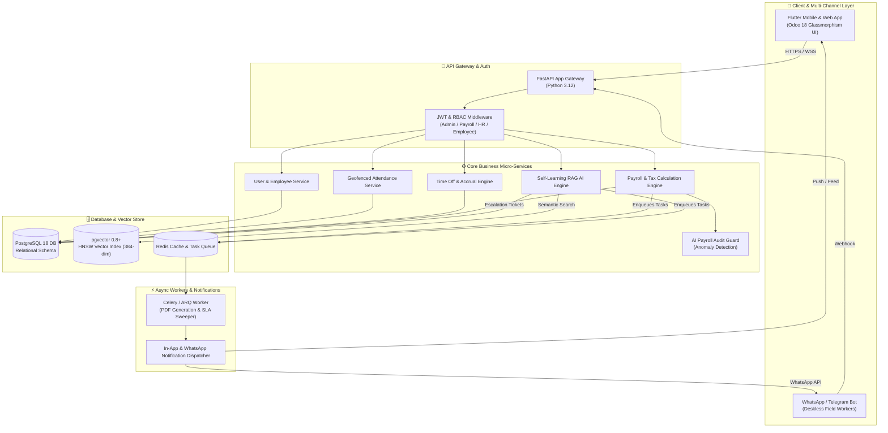
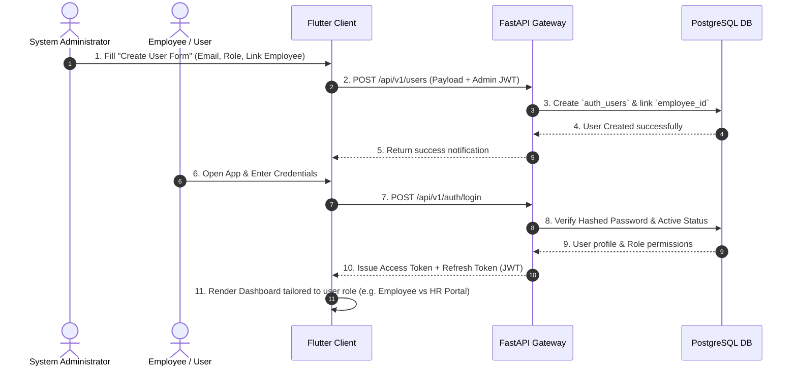
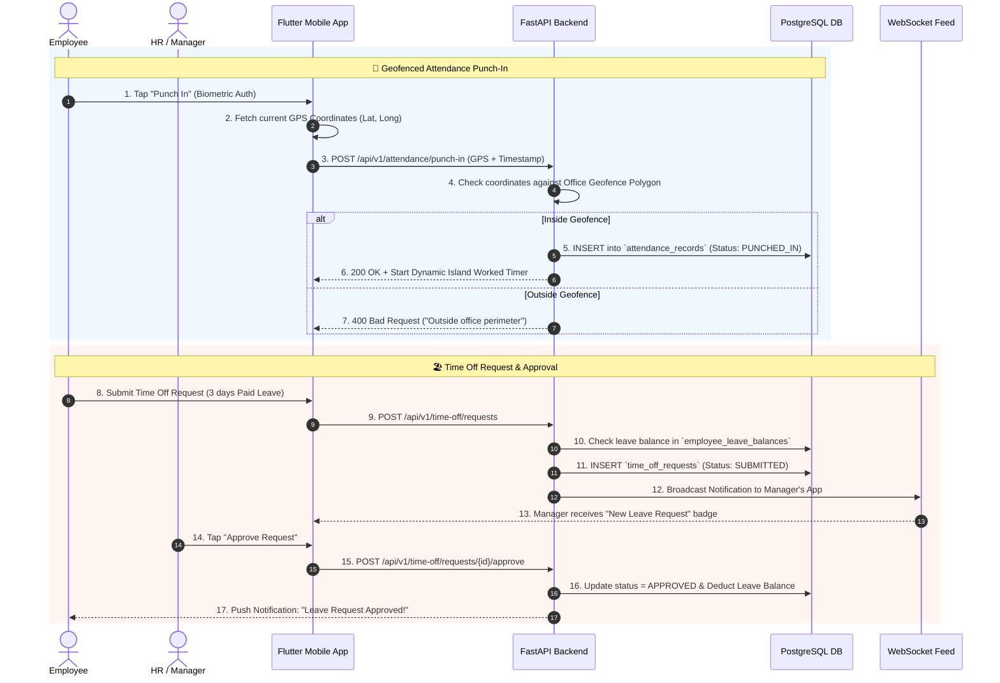
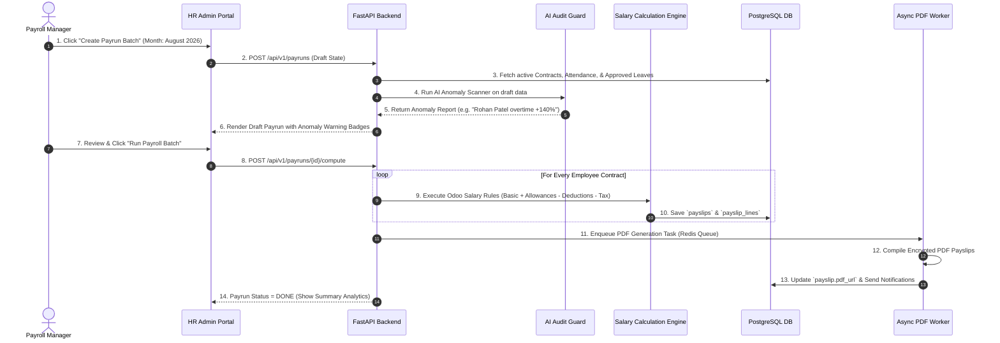
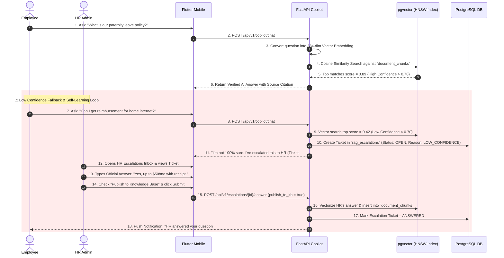

# 🔄 PeoplePay360: End-to-End System Workflow & Architecture Guide

> **Purpose**: A clear, comprehensive, and visual explanation of how the entire **PeoplePay360** HR & Payroll ecosystem works from Frontend to Backend, Database, AI Engine, and Async Workers.

---

## 📐 1. Master System Architecture Overview

---

## 🛠️ 2. Core End-to-End Workflows

Below are the 4 fundamental workflows that drive the entire application.

---

### 🔑 Workflow A: User Onboarding, Login & Strict RBAC Access

This workflow governs how users enter the system and how security roles restrict features.

#### Key Rules:
- **Role Scoping**: `ADMIN` sees User Management & Global Configs; `PAYROLL_USER` sees Payruns; `EMPLOYEE` sees only self profile, own attendance, and own payslips.
- **Link Integrity**: Every user account MUST be linked to an `employee` record.

---

### ⏱️ Workflow B: Geofenced Punch-In & Automated Time Off Accrual

How employees record attendance and request time off.

---

### 💰 Workflow C: Automated 1-Tap Payroll Batch & AI Audit Guard

How HR processes salary for hundreds of employees safely with zero errors.

---

### 🤖 Workflow D: Self-Learning AI Copilot & Human Escalation Loop

This is the **Unfair Advantage Feature**: How AI answers policy questions and automatically learns when stuck.

---

## 🏛️ 3. Layer-by-Layer Responsibilities

| Layer | Technologies | Responsibilities |
| :--- | :--- | :--- |
| **Frontend UI** | Flutter 3.24 (Dart) | Glassmorphic UI, Dynamic Island Header, Smart Button Stat Counters, Geofence Map, Interactive Payslip Dialog |
| **API Gateway** | FastAPI (Python 3.12) | Route handling, JWT verification, Pydantic request validation, Swagger docs |
| **Domain Services** | Python Business Modules | Attendance calculation, Salary rule evaluation, Accrual engine, Copilot Orchestration |
| **AI / RAG Engine** | `sentence-transformers` + `pgvector` | 384-dimensional embedding creation, HNSW cosine similarity search, Escalation routing |
| **Primary Database** | PostgreSQL 18 | Relational integrity, FK cascades, check constraints, indexed audit trail |
| **Async Task Worker**| Redis + Celery / ARQ | Background PDF compilation, SLA breach sweeper, Email/WhatsApp dispatches |

---

## 🎯 4. Why This Architecture Wins

1. **Zero Hallucination AI Guarantee**: Low confidence questions are never answered blindly—they are escalated to human HR.
2. **Self-Improving System**: Every answered escalation ticket feeds back into `pgvector` to make the bot smarter.
3. **Strict Audit Trail**: Every payrun step and escalation status change is immutably logged with timestamp and user ID.
4. **Resilient Field Access**: Field workers can interact via WhatsApp bot, while office workers use the high-performance Flutter app.
